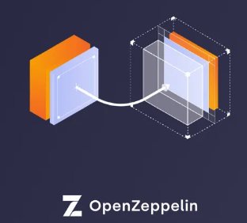

<a name="readme-top"></a>

[![Contributors][contributors-shield]][contributors-url]
[![Forks][forks-shield]][forks-url]
[![Stargazers][stars-shield]][stars-url]
[![Issues][issues-shield]][issues-url]
[![MIT License][license-shield]][license-url]
[![LinkedIn][linkedin-shield]][linkedin-url]

<!-- PROJECT LOGO -->
<br />
<div align="center">
  <a href="https://github.com/Aboudoc/Ethernaut-OpenZeppelin">
    
  </a>

<h3 align="center">Transparent Proxy Pattern</h3>

  <p align="center">
    project_description
    <br />
    <a href="https://github.com/Aboudoc/Ethernaut-OpenZeppelin"><strong>Explore the docs »</strong></a>
    <br />
    <br />
    <a href="https://github.com/Aboudoc/Ethernaut-OpenZeppelin">View Demo</a>
    ·
    <a href="https://github.com/Aboudoc/Ethernaut-OpenZeppelin/issues">Report Bug</a>
    ·
    <a href="https://github.com/Aboudoc/Ethernaut-OpenZeppelin/issues">Request Feature</a>
  </p>
</div>

<!-- TABLE OF CONTENTS -->
<details>
  <summary>Table of Contents</summary>
  <ol>
    <li>
      <a href="#about-the-project">About The Project</a>
      <ul>
        <li><a href="#built-with">Built With</a></li>
      </ul>
    </li>
    <li>
      <a href="#getting-started">Getting Started</a>
      <ul>
        <li><a href="#prerequisites">Prerequisites</a></li>
        <li><a href="#installation">Installation</a></li>
      </ul>
    </li>
    <li><a href="#usage">Usage</a></li>
    <li><a href="#roadmap">Roadmap</a></li>
    <li><a href="#contributing">Contributing</a></li>
    <li><a href="#license">License</a></li>
    <li><a href="#contact">Contact</a></li>
    <li><a href="#acknowledgments">Acknowledgments</a></li>
  </ol>
</details>

<!-- ABOUT THE PROJECT -->

## About The Project

[![Product Name Screen Shot][product-screenshot]](https://example.com)

<p align="right">(<a href="#readme-top">back to top</a>)</p>

### Built With

-   [![Hardhat][Hardhat]][Hardhat-url]
-   [![Ethers][Ethers.js]][Ethers-url]

<p align="right">(<a href="#readme-top">back to top</a>)</p>

<!-- GETTING STARTED -->

## Getting Started

To get a local copy up and running follow these simple example steps.

### Prerequisites

-   yarn

    ```sh
    yarn
    ```

-   hardhat

    ```sh
    yarn add --dev hardhat
    ```

    ```sh
    yarn add --dev @nomiclabs/hardhat-ethers@npm:hardhat-deploy-ethers ethers @nomiclabs/hardhat-etherscan @nomiclabs/hardhat-waffle chai ethereum-waffle hardhat hardhat-contract-sizer hardhat-deploy hardhat-gas-reporter prettier prettier-plugin-solidity solhint solidity-coverage dotenv
    ```

    OpenZeppelin contracts:

    ```sh
    yarn add --dev @openzeppelin/contracts
    ```

    run:

    ```sh
    yarn hardhat
    ```

### Installation

1. Clone the repo
    ```sh
    git clone https://github.com/Aboudoc/Ethernaut-OpenZeppelin.git
    ```
2. Install NPM packages
    ```sh
    yarn
    ```

<p align="right">(<a href="#readme-top">back to top</a>)</p>

<!-- USAGE EXAMPLES -->

## Usage

If you need testnet funds, use the [Alchemy testnet faucet](https://goerlifaucet.com/).

**This project shows how to deploy upgradable contracts using hardhart-deploy's built-in proxies**

There are mainly three ways to deploy upgradable contracts:

1. Deploy a Proxy manually (coming soon...)
2. Hardhat-deploy's built-in proxies
3. OpenZeppelin upgrades plugin (coming soon...)

We'll be using hardhat-deploy's built-in proxies

We're gonna deploy our Box contract behind an [Open Zeppelin's Transparent proxy](https://github.com/OpenZeppelin/openzeppelin-contracts/blob/master/contracts/proxy/transparent/TransparentUpgradeableProxy.sol) that is owned by a Box proxy admin contract.

To deploy using the [Upgradable Transparent Proxy from OpenZeppelin](https://github.com/OpenZeppelin/openzeppelin-contracts/blob/master/contracts/proxy/transparent/TransparentUpgradeableProxy.sol):

```js
const box = await deploy("Box", {
    from: deployer,
    args: [],
    log: true,
    waitConfirmations: waitBlockConfirmations,
    proxy: {
        proxyContract: "OpenZeppelinTransparentProxy",
        viaAdminContract: {
            name: "BoxProxyAdmin",
            artifact: "BoxProxyAdmin",
        },
    },
})
```

Inside contracts folder, create a new folder called proxy, create a new file called `BoxProxyAdmin.sol`

For this contract, we gonna use `ProxyAdmin` contract from [OpenZeppelin](https://github.com/OpenZeppelin/openzeppelin-contracts/blob/master/contracts/proxy/transparent/ProxyAdmin.sol)

```js
import "@openzeppelin/contracts/proxy/transparent/ProxyAdmin.sol"
```

It has the following functions: `getProxyAdmin`, `changeProxyAdmin`, `upgrade`, `upgradeAndCall`, for dealing with upgradable contracts

To make our `BoxProxyAdmin` work with the hardhat-deploy plugin, our `constructor` needs to take in address of the owner as an input parameter (leave it blank).

Then add the `ProxyAdmin()` (leave it blank):

```js
constructor(
        address /* owner */
    ) ProxyAdmin() {
```
## Deployment Box

Run:

```sh
yarn hardhat deploy
```

Logs: 

```sh
deploying "BoxProxyAdmin" (tx: 0xc94207886d748f906e53d7a2798763190817adac2a38330e47fe87d39b6f0d4b)...: deployed at 0x5FbDB2315678afecb367f032d93F642f64180aa3 with 789633 gas
deploying "Box_Implementation" (tx: 0xff39800307b608cc4c511cac0bcb3395cdc8db9e47c87d8283fd7f4bca79b760)...: deployed at 0xe7f1725E7734CE288F8367e1Bb143E90bb3F0512 with 148843 gas
deploying "Box_Proxy" (tx: 0xaaf84b27ed0b08c12f2db96a1210087519417ed9bc1d0601122e3f8c8c34d5ea)...: deployed at 0x9fE46736679d2D9a65F0992F2272dE9f3c7fa6e0 with 720430 gas
----------------------------------------------------
```
First, we deploy our `BoxProxyAdmin` (our admin contract). Then we deploy `Box_implementation`

=> `hardhat-deploy` run ahead and took our 'Box' contract and renamed it to `Box_implementation` and then deployed it

Finally, it deployed `BoxProxy`, which will point to the logic of `Box`

## Deployment BoxV2

Write a basic deployment script using hardhat-deploy, then create a script to do the upgrade: `upgrade-box.js`

We do the manual way to see the functions called to do the upgrade process (upgrade). 

We can do the same using the plugin from OpenZeppelin 

```js
async function main() {
    const boxProxyAdmin = await ethers.getContract("BoxProxyAdmin")
    const transparentProxy = await ethers.getContract("Box_Proxy")

    // We get our version V1
    const proxyBoxV1 = await ethers.getContractAt("Box", transparentProxy.address)
    const versionV1 = await proxyBoxV1.version()
    console.log(versionV1)

    //We upgrade
    const boxV2 = await ethers.getContract("BoxV2")
    const upgradeTx = await boxProxyAdmin.upgrade(transparentProxy.address, boxV2.address)
    await upgradeTx.wait(1)

    // We check the version at the same address, checking if upgrade succeeded
    const proxyBoxV2 = await ethers.getContractAt("BoxV2", transparentProxy.address)
    const versionV2 = await proxyBoxV2.version()
    console.log(versionV2)
}
```

### Upgrade to V2 on hardhat node:

```sh
yarn hardhat node
```

All contracts are deployed: `BoxProxyAdmin`, `Box_Implementation`, `Box_proxy` and the `BoxV2`implementation

Make a new terminal to run `upgrade-box.js`: 

```sh
yarn hardhat run scripts/upgrade-box.js --network localhost
```

```sh
BigNumber { _hex: '0x01', _isBigNumber: true }
BigNumber { _hex: '0x02', _isBigNumber: true }
✨  Done in 2.48s.
```

## Upgrade to V2 using OpenZppelin upgrade's plugin:

First we deploy the proxy in `./hardhatPlugin/deploy.js` by calling `upgrades.deployProxy()` then we call `upgrades.prepareUpgrade()` from `prepareUpgrade.js` and the `upgrades.upgradeProxy()` from `upgrade.js`

To learn more, follow this tutorial: [OpenZeppelin Upgrades: Step by Step Tutorial for Hardhat](https://forum.openzeppelin.com/t/openzeppelin-upgrades-step-by-step-tutorial-for-hardhat/3580)

## hardhat-deploy in a nutshell

Here is a very simple summary of the basic feature of **hardhat-deploy**.

**hardhat-deploy** allows you to write [`deploy scripts`](#deploy-scripts) in the `deploy` folder. Each of these files that look as follows will be executed in turn when you execute the following task: `hardhat --network <networkName> deploy`

```js
// deploy/00_deploy_my_contract.js
module.exports = async ({ getNamedAccounts, deployments }) => {
    const { deploy } = deployments
    const { deployer } = await getNamedAccounts()
    await deploy("MyContract", {
        from: deployer,
        args: ["Hello"],
        log: true,
    })
}
module.exports.tags = ["MyContract"]
```

Furthermore you can also ensure these scripts are executed in test too by calling `await deployments.fixture(['MyContract'])` in your test.
This is optimized, so if multiple tests use the same contract, the deployment will be executed once and each test will start with the exact same state.

This is a huge benefit for testing since you are not required to replicate the deployment procedure in your tests. The tag feature (as seen in the script above) and [dependencies](#deploy-scripts-tags-and-dependencies) will also make your life easier when writing complex deployment procedures.

You can even group deploy scripts in different sub folder and ensure they are executed in their logical order.

Furthermore hardhat-deploy can also support a multi-chain settings like L1, L2 with multiple deploy folder specific to each network.

**All of this can also be bundled in a npm package so user of hardhat-deploy can reuse your deployment procedure and get started integrating with your project locally.**

## Further reading

There is a tutorial covering the basics here : https://github.com/wighawag/tutorial-hardhat-deploy

Learn more about [hardhat deployment plugin](https://github.com/wighawag/hardhat-deploy)

Check this [repo](https://github.com/Aboudoc/Transparent-Upgradable-Proxy-assembly) for a deep overview of assembly used to write to any storage slot and to return data from fallback

<p align="right">(<a href="#readme-top">back to top</a>)</p>

<!-- ROADMAP -->

## Roadmap

-   [ ] unit test `boxUpgrades.test.js`


See the [open issues](https://github.com/Aboudoc/Ethernaut-OpenZeppelin/issues) for a full list of proposed features (and known issues).

<p align="right">(<a href="#readme-top">back to top</a>)</p>

<!-- CONTRIBUTING -->

## Contributing

Contributions are what make the open source community such an amazing place to learn, inspire, and create. Any contributions you make are **greatly appreciated**.

If you have a suggestion that would make this better, please fork the repo and create a pull request. You can also simply open an issue with the tag "enhancement".
Don't forget to give the project a star! Thanks again!

1. Fork the Project
2. Create your Feature Branch (`git checkout -b feature/AmazingFeature`)
3. Commit your Changes (`git commit -m 'Add some AmazingFeature'`)
4. Push to the Branch (`git push origin feature/AmazingFeature`)
5. Open a Pull Request

<p align="right">(<a href="#readme-top">back to top</a>)</p>

<!-- LICENSE -->

## License

Distributed under the MIT License. See `LICENSE.txt` for more information.

<p align="right">(<a href="#readme-top">back to top</a>)</p>

<!-- CONTACT -->

## Contact

Reda Aboutika - [@twitter_AboutikaR](https://twitter.com/AboutikaR) - reda.aboutika@gmail.com

Project Link: [https://github.com/Aboudoc/Ethernaut-OpenZeppelin](https://github.com/Aboudoc/Ethernaut-OpenZeppelin)

<p align="right">(<a href="#readme-top">back to top</a>)</p>

<!-- ACKNOWLEDGMENTS -->

## Acknowledgments

-   [Patrick Collins](https://github.com/PatrickAlphaC)

<p align="right">(<a href="#readme-top">back to top</a>)</p>

<!-- MARKDOWN LINKS & IMAGES -->
<!-- https://www.markdownguide.org/basic-syntax/#reference-style-links -->

[contributors-shield]: https://img.shields.io/github/contributors/Aboudoc/Ethernaut-OpenZeppelin.svg?style=for-the-badge
[contributors-url]: https://github.com/Aboudoc/Ethernaut-OpenZeppelin/graphs/contributors
[forks-shield]: https://img.shields.io/github/forks/Aboudoc/Ethernaut-OpenZeppelin.svg?style=for-the-badge
[forks-url]: https://github.com/Aboudoc/Ethernaut-OpenZeppelin/network/members
[stars-shield]: https://img.shields.io/github/stars/Aboudoc/Ethernaut-OpenZeppelin.svg?style=for-the-badge
[stars-url]: https://github.com/Aboudoc/Ethernaut-OpenZeppelin/stargazers
[issues-shield]: https://img.shields.io/github/issues/Aboudoc/Ethernaut-OpenZeppelin.svg?style=for-the-badge
[issues-url]: https://github.com/Aboudoc/Ethernaut-OpenZeppelin/issues
[license-shield]: https://img.shields.io/github/license/Aboudoc/Ethernaut-OpenZeppelin.svg?style=for-the-badge
[license-url]: https://github.com/Aboudoc/Ethernaut-OpenZeppelin/blob/master/LICENSE.txt
[linkedin-shield]: https://img.shields.io/badge/-LinkedIn-black.svg?style=for-the-badge&logo=linkedin&colorB=555
[linkedin-url]: https://www.linkedin.com/in/r%C3%A9da-aboutika-34305453/?originalSubdomain=fr
[product-screenshot]: https://res.cloudinary.com/divzjiip8/image/upload/c_scale,w_239/v1587421101/mascots_dge1th.png
[Hardhat]: https://img.shields.io/badge/Hardhat-20232A?style=for-the-badge&logo=hardhat&logoColor=61DAFB
[Hardhat-url]: https://hardhat.org/
[Ethers.js]: https://img.shields.io/badge/ethers.js-000000?style=for-the-badge&logo=ethersdotjs&logoColor=white
[Ethers-url]: https://docs.ethers.org/v5/
[Vue.js]: https://img.shields.io/badge/Vue.js-35495E?style=for-the-badge&logo=vuedotjs&logoColor=4FC08D
[Vue-url]: https://vuejs.org/
[Angular.io]: https://img.shields.io/badge/Angular-DD0031?style=for-the-badge&logo=angular&logoColor=white
[Angular-url]: https://angular.io/
[Svelte.dev]: https://img.shields.io/badge/Svelte-4A4A55?style=for-the-badge&logo=svelte&logoColor=FF3E00
[Svelte-url]: https://svelte.dev/
[Laravel.com]: https://img.shields.io/badge/Laravel-FF2D20?style=for-the-badge&logo=laravel&logoColor=white
[Laravel-url]: https://laravel.com
[Bootstrap.com]: https://img.shields.io/badge/Bootstrap-563D7C?style=for-the-badge&logo=bootstrap&logoColor=white
[Bootstrap-url]: https://getbootstrap.com
[JQuery.com]: https://img.shields.io/badge/jQuery-0769AD?style=for-the-badge&logo=jquery&logoColor=white
[JQuery-url]: https://jquery.com
